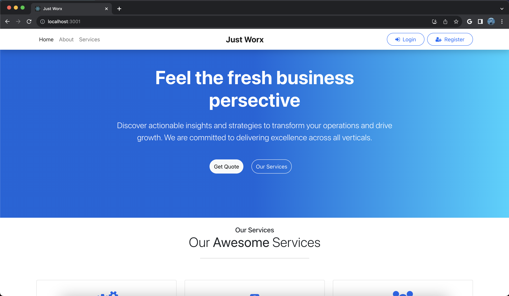
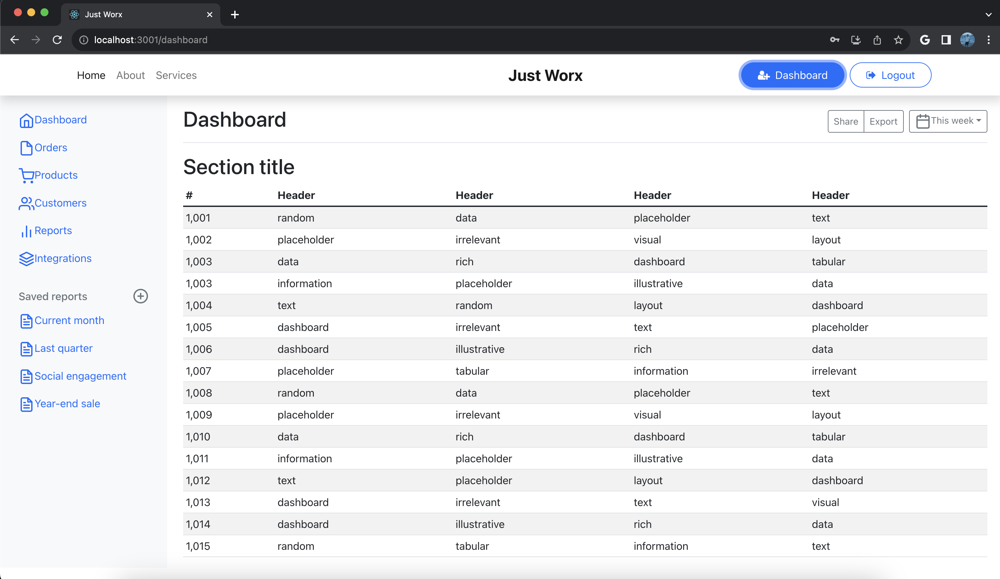

Home Page

Dashboard Page

# React Learning Repository

## Overview

This repository served as a playground for when I first started learning React. The primary aim is to facilitate learning of React and its associated technologies.

## Projects Included

### Backend

This portion of the repository contains server-side code which focuses on tasks like authentication and database connectivity.

- **Technologies**: Node.js, Express, MongoDB
- **Key Files**: `conn.js` (Database Connection), `authenticate.js` (Authentication Logic), `userSchema.js` (User Schema)

### MERN Website

This is a full-stack MERN (MongoDB, Express, React, Node.js) application that includes a variety of components.

- **Technologies**: React, Node.js, MongoDB
- **Key Components**: Home, About, Services, Dashboard, Login, Register, Logout, Navbar, Footer

## How to Run

### Backend

1. Navigate to the `backend` folder.
2. Execute `npm install` to install the necessary dependencies.
3. Run `npm start` to initiate the server.

### MERN Website

1. Move to the `mernwebsite` directory.
2. Run `npm install` to fetch all required packages.
3. Use `npm start` to launch the React application.

## Contributing

Contributions are welcomed. Feel free to fork the repository and submit pull requests.

## License

The project falls under the MIT License, allowing for considerable flexibility in its usage and modification.